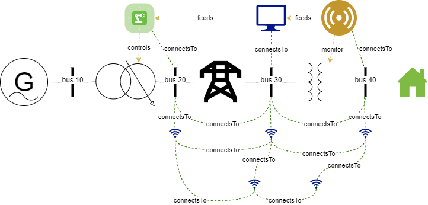

# Smart Grid Ontology (WIP)

This document details the specifics for the Smart Grid Ontology

## Example Smart Grid

This is a simple example of how the Smart Grid ontology can represent the power, network, and control graph for the example above.

The power grid is comprised of:

- a generator
- a multi-tap transformer
- a simple electrical line
- a simple transformer
- a simple single household load

The control graph is comprised of:

- a voltage sensor that is monitoring the secondary winding of the simple transformer
- a voltage controller that is fed raw data from the voltage sensor
- an actuator that controls the tap settings on the multi-tap transformer

The network graph is comprised of:

- 5 wireless repeaters (nodes)
- 3 wired nodes that are co-located at bus 20, 30 and 40

## Defining the Control flow

The control flow coloured (light gold) represents the control flow of the smart grid. A sensor can monitor an electrical equipment using the `monitor` relation. An actuator can control an electrical equipment using the `controls` relation.
Information flow between the sensor, controller, and actuator is done using the `feeds` relation.

Sensors, controllers, and actuators are themselves devices that can act as nodes. They can co-located to an equipment, or be placed elsewhere and have a different location. These devices connects to the electrical bus which are nodes to be part of the networking graph.

## Defining the Network Topology

Using the `connectsTo` relation between `nodes` creates a link between those `nodes`. In our ontology both electrical `buses` and `communication_nodes` can be `nodes`.

In the example above `bus 20`, `bus 30`, and `bus 40` has a `connectsTo` relation.
There is also a wireless connections between the buses.

## Defining the Power Topology

All electrical equipment must be connected to a bus using the `primaryAttachsTo` and `attachsTo` relationship. The `primaryAttachsTo` is the connection for bus 1 and `attachsTo` is the connection for bus 2. If the equipment only connects to a single bus then use the `primaryAttachsTo` relationship.
